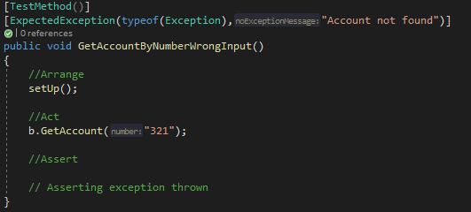

# Assignment 1

## Intro
Vi har skrevet koden fra bunden, ud fra det diagram der var givet med til opgaven.

Opgaven er skrevet i C# og det anbefales Visual studio for at køre det.

Vi har lavet tre test klasser, som kan ses her under:

## Arrange, Act, Assert
Vi anvender AAA tilgangen: Arrange, Act, Assert.
I Arrange anvender vi en setup metode for at instantere de objecter der er behov for, for at kunne udfører tests:

I Act fortager vi de handlinger som skal lede til det state i programmet, som vi forventer.

I Assert checker vi så om den state er opnået.

## Account tests
Vi har taget os den frihed at omdøbe de to transfer metoder fra diagrammet, til hhv. "Withdraw" og "Deposit".

Vi har tre tests til Account klassen, vi tester hhv.
* Er penge deposited
    * 
* Er penge withdrawn
    * 
* Er overførelsen logget korrekt
    * 

## Customer tests
I customer klassen tester vi transfer metoden således:

## Bank tests
Vi har tre tests under bank klassen

* GetAccountByNumber
    * 
* GetAccountByNumberWrongInput
    * 
* GetAccountsByCustomer
    * 

 
